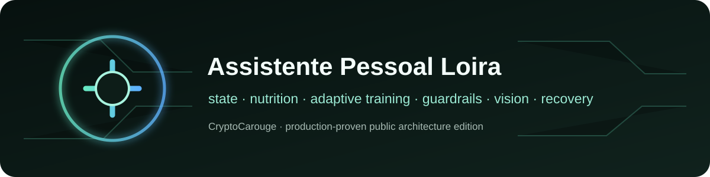
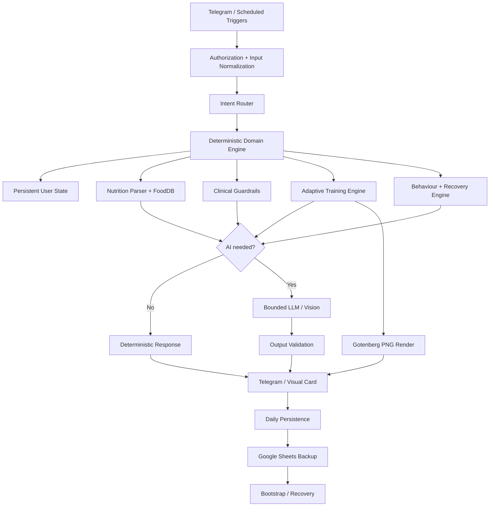

  

  
**Portfolio-safe public architecture · production workflow and private user data remain private**

# Stateful Wellness Coach AI Agent

A production-proven personal wellness orchestration architecture built with **n8n, JavaScript, Telegram, OpenAI, Google Sheets and Gotenberg**.

The private production system combines deterministic state machines, adaptive nutrition, progressive training, symptom-aware clinical guardrails, specialist-rule memory, multimodal progress analysis, behavioural pattern detection, operational fallbacks and long-term state recovery.

This repository documents the engineering without exposing the person behind the production deployment, private health data, sensitive personal content, photographs, identifiers, credentials, private prompts or production workflow JSON.

> **Deep dive:** [Architecture](docs/architecture.md) · [Feature matrix](docs/feature-matrix.md) · [State model](docs/state-model.md) · [Privacy boundary](docs/privacy-boundary.md) · [Case study](docs/case-study.md)

## Production footprint

Verified against the active private production workflow on **2026-09-29**:

- **87 workflow nodes**
- **12 triggers**
- **33 Code nodes**
- **118 distinct Telegram callback actions**
- Deterministic nutrition parsing with FoodDB + aliases
- Stateful clinical support for digestive and lower-limb symptom tracking
- Four-session adaptive strength cycle with recovery and block modes
- Dynamic visual workout cards rendered to PNG through Gotenberg
- Daily, weekly and monthly longitudinal reporting
- Baseline-vs-current multimodal photo analysis
- Google Sheets persistence plus live-state bootstrap recovery
- Undo snapshots, duplicate protection and stale-action protection
- Optional private wellbeing module excluded from this public edition

These numbers describe the production architecture. They are not synthetic benchmark claims.

## Why this system is different

The LLM is **not** the control plane.

Routing, state, nutrition arithmetic, duplicate prevention, clinical gating, training progression, recovery logic, persistence and safety checks are implemented deterministically. AI is used where interpretation, natural language or multimodal reasoning adds value.

That gives the system a clear operating rule:

> **deterministic control first → bounded AI second → validate → persist only confirmed state**

## Architecture

## Core capability map

| Domain | Production capability | Public representation |
| --- | --- | --- |
| Nutrition | FoodDB, aliases, macros, correction, confidence scoring, duplicate prevention | Architecture + safe schema |
| Training | 4-session cycle, RPE, symptom-aware adaptation, recovery/rest modes | Decision flow + state model |
| Health support | Symptom state, red flags, specialist-rule priority, conservative gating | Guardrail architecture only |
| Behaviour | 3/7/30-day patterns, energy, consistency, night-risk trends | Pattern engine design |
| Memory | Live state, daily logs, snapshots, Google Sheets restore | Generic persistence model |
| Vision | Health-metric extraction + baseline/current progress analysis | Multimodal pipeline design |
| Reporting | Daily, weekly and monthly summaries | Generic report pipeline |
| UX | Telegram menus, 118 callbacks, undo, stale-action guards | Interaction architecture |
| Visual training | Dynamic HTML → Gotenberg PNG → Telegram | Safe rendering example |
| Private wellbeing | Optional private production module | Excluded from the public implementation |

## Safety hierarchy

The private production system uses an explicit priority order before generation:

1. safety / symptom red flags
2. energy and recovery
3. training eligibility and adaptation
4. nutrition support
5. motivation and optional wellbeing content

A lower-priority module cannot override a higher-priority safety decision.

## Resilient state

A daily reset does not erase long-term intelligence.

Before daily state is cleared, the workflow persists a final record. Longitudinal state such as weight history, confirmed specialist rules, clinical learning, behavioural patterns, baseline media references and decision context is preserved.

If volatile workflow state is lost, the system can reconstruct operational state from persisted Google Sheets history.

See [State model](docs/state-model.md).

## Privacy boundary

This repository intentionally excludes:

- names and personal profiles
- health records and private symptoms
- personal photographs and Telegram file IDs
- sensitive personal content from private wellbeing modules
- chat IDs, spreadsheet IDs and document URLs
- API keys, bot tokens, OAuth credentials and webhooks
- private prompts containing personal context
- production workflow JSON
- production-only decision parameters that would reveal sensitive personal logic

See [Privacy boundary](docs/privacy-boundary.md).

## Engineering principles demonstrated

- **Deterministic before generative**
- **Explicit mutable state**
- **Human confirmation before durable medical-rule changes**
- **Safety gates before coaching**
- **AI only where interpretation adds value**
- **Persist confirmed outcomes, not assumptions**
- **Idempotency and stale-action protection**
- **Undoable state mutation**
- **Graceful visual fallback**
- **Recoverable memory**
- **Privacy by design**

## Technology

`n8n` · `JavaScript` · `OpenAI Responses API` · `Telegram Bot API` · `Google Sheets` · `Gotenberg` · `HTML/CSS/SVG` · `GitHub-hosted exercise media`

## Repository policy

This is an **engineering case study and public architecture edition**, not the production system and not a medical device.

It must not be used as a substitute for medical care. Any health-oriented implementation should be reviewed for its own users, jurisdiction, clinical scope, privacy obligations and failure modes.

## Status

**Public architecture showcase. Private production system remains isolated.**
